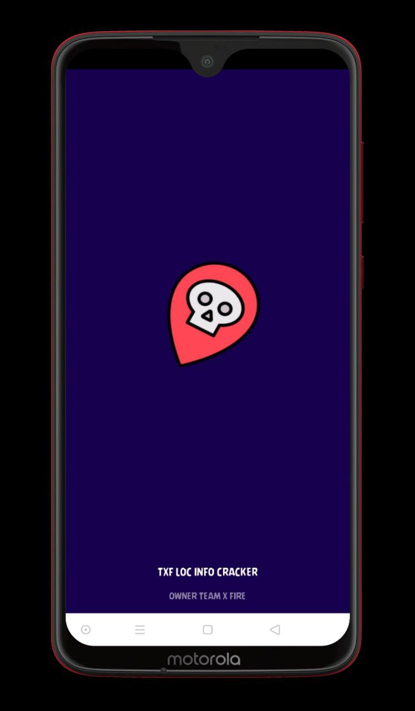
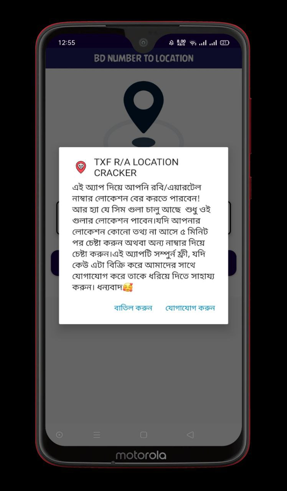
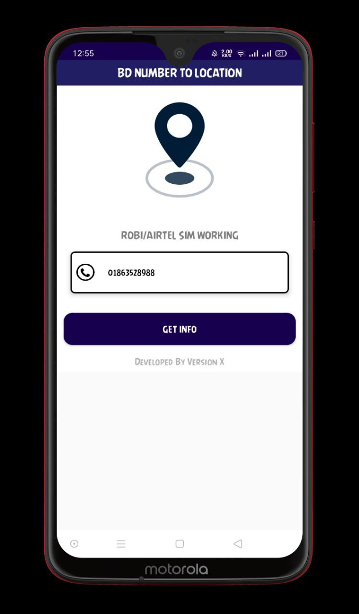
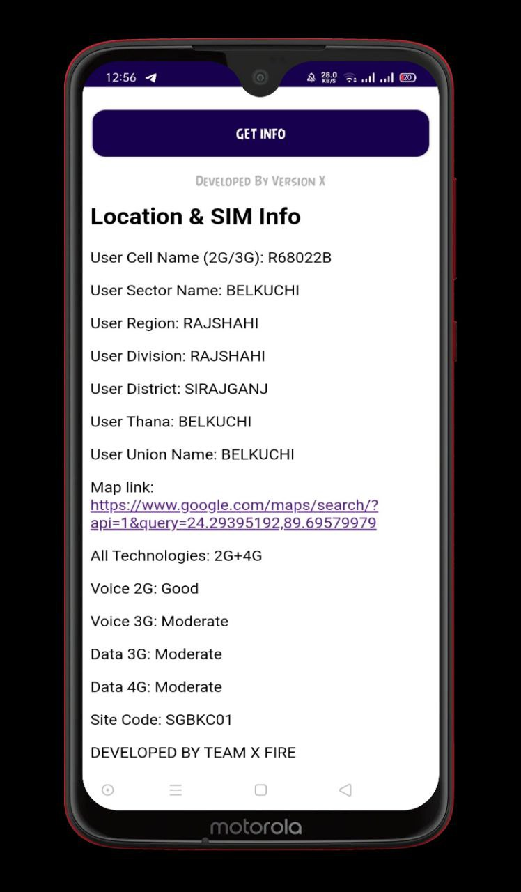

<h1 align=center>Team X Fire</h1>

# number-to-loacation-app
Remember :- This App Made For Educational Purpose Only. Don't Use Any Iligel Activity And Don't Harm Anyone. Team X Fire will not be responsible if you use it for any unethical activity.

## Features

 - USER SIM TOWER ADDRESS CRACK 
 - Easy to use 
 - USER SIM INFO CRACK
 - MAP LOCATION CRACK
 - NO VIRUS IN APP

## Requirements
 - Android Phone
 - Version 6.0+
 
 ## DOWNLOAD
 <a href="https://github.com/teamxfire/number-to-loacation-app/raw/main/TXF%20NUMBER%20TO%20LOCATION.apk">DOWNLOAD</a>

## DISCLAIMER

 TO BE USED FOR EDUCATIONAL PURPOSES ONLY

The use of the TXF LOCATIONCRACKER Tool is COMPLETE RESPONSIBILITY of the END-USER. Developers assume NO liability and are NOT responsible for any misuse or damage caused by this program..

